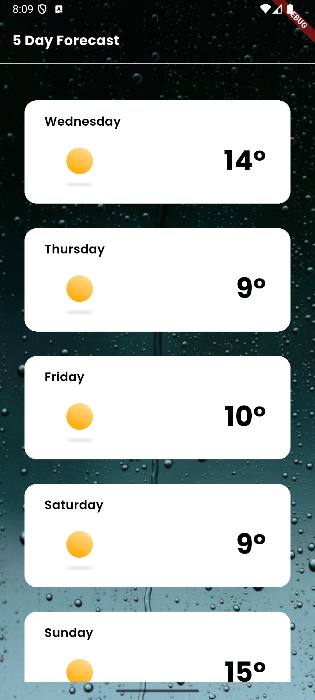

# Weather App



A streamlined weather application that provides a 5-day forecast based on the user's current location.

## Architecture & Conventions

### Architecture: MVVM + BLoC
The project follows the **MVVM (Model-View-ViewModel)** pattern, utilizing **BLoC (Business Logic Component)** for state management. This ensures a clean separation between the UI and business logic without the usual `flutter_bloc` library, but a custom implementation to show deep understanding of reactive streams in Dart.

- **Models**: Plain Dart objects representing the weather data (`Forecast`, `ForecastItem`, `ForecastMain`).
- **ViewModels (BLoC)**: Handles the logic for fetching data, managing loading/error states, and processing raw API data (filtering midday samples).
- **Views**: Flutter widgets that react to the state stream from the BLoC.
- **Repositories**: Acts as a data provider, abstracting the `ApiService` and the network layer.

### Conventions
- **Naming**: Follows the official Dart/Flutter style guide.
- **Modularity**: Code is split into logical folders (`network`, `services`, `mvvm`, `helpers`).
- **Statelessness**: Preference for `StatelessWidget` where possible, delegating state to the BLoC.
- **Testing**: A comprehensive, modular test suite covering unit and widget tests with zero external testing dependencies.

## Third-Party Dependencies

The project minimizes external dependencies to demonstrate native Flutter proficiency:

| Package | Purpose |
| :--- | :--- |
| `geolocator` | Accessing the device's GPS coordinates. |
| `geocoding` | Converting GPS coordinates into human-readable city names. |
| `flutter_lints` | Ensuring code quality and consistency with recommended rules. |

*Note: All mocks are custom-built stubs.*

## Configuration & Environment

This project uses environment variables to keep API keys secure. 

### API Key Setup
1. Create a `.env.json` file in the root directory.
2. Add your OpenWeather API key to the file:
   ```json
   {
     "OPEN_WEATHER_API_KEY": "your_api_key_here"
   }
   ```
   *(Note: `.env.json` is already added to `.gitignore` to prevent leaking your key.)*

### IDE Integration
The project is pre-configured to automatically pick up the `.env.json` file when running from your IDE:
- **Android Studio / IntelliJ**: The included `.idea/runConfigurations/main_dart.xml` adds the necessary `--dart-define-from-file` flag.
- **VS Code**: The `.vscode/launch.json` file is configured with the required `args`.

## How to Build

### Prerequisites
- Flutter SDK (Stable channel, version >= 3.7.0)
- Android Studio / VS Code with Flutter extensions
- Xcode (for iOS)
- An active internet connection for API calls
- Location services enabled on the device/emulator

### Steps
1. **Clone the repository**:
   ```bash
   git clone <repository_url>
   ```
2. **Configure Git Hooks** (Optional but recommended):
   ```bash
   git config core.hooksPath .githooks
   ```
3. **Set up your API Key** (See [API Key Setup](#api-key-setup) above).
4. **Install dependencies**:
   ```bash
   flutter pub get
   ```
5. **Run the project**:
   - Simply use the **Run** button in Android Studio or VS Code.
   - Or run via CLI:
     ```bash
     flutter run --dart-define-from-file=.env.json
     ```

## CI/CD & Automation

- **GitHub Actions**: A workflow is provided in `.github/workflows/main.yml` that automatically runs formatting checks, linting (with fatal warnings), unit tests, and builds a debug APK on every push and pull request.
- **Git Hooks**: A pre-commit hook is included in `.githooks/` that automatically formats code and runs analysis before allowing a commit.

## Additional Considerations & "Nice-to-haves"

- **Midday Filtering**: The OpenWeather 5-day forecast API provides data in 3-hour intervals (40 samples). The BLoC filters these down to a single "best match" for midday (12:00 PM) for each of the 5 days.
- **Custom ApiService**: Built on top of Dart's native `HttpClient` with built-in **10-second timeout** protection for all requests.
- **Zero-Dependency Testing**: The test suite demonstrates advanced manual stubbing techniques, achieving high coverage without external mocking frameworks.
